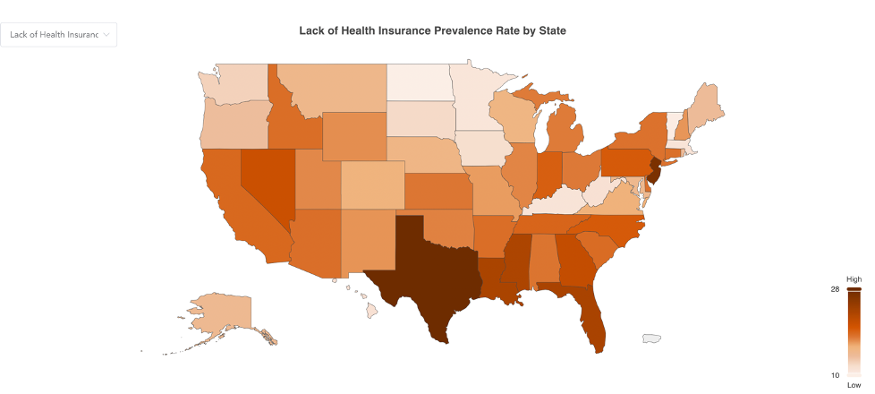
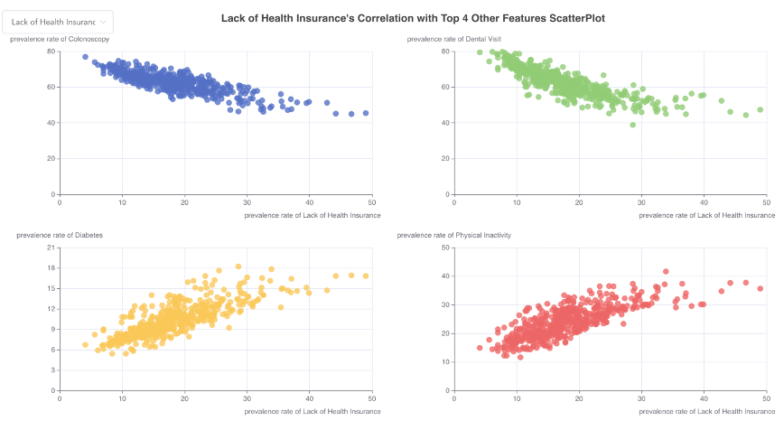
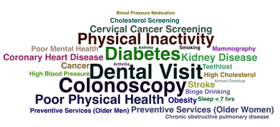

# IVDA Course Project

## Introduction
IVDA Final Project - Healthcare US CDC 500 Cities

This project utilizes public datasets from CDC 500 Cities Project released in 2016, and explores the following three data analysis questions:

Q1:What is the prevalence rate of the various health conditions (disease & health status) and behaviors (prevention & risk behavior)for each state?

Q2: How would the specific disease correlate with other features? And what are the top four most correlated features?

Q3: How will theprevalence rate for Coronary Heart Disease be influenced by the prevalence rate of current lifestyle and disease?

The interactive local webpage is developed in Vue.js and Python.

## How to use

1. Download this repository to your local machine.
2. Install npm and node through the node.js website. Install the recommended version.
- check in terminal/cmd that the node version > 16.15: ``node -v``
- check npm version > 8.3.0: ``npm -v``
3. Open a terminal and run: ``npm install``.
4. Navigate to this folder and run in the same terminal ``npm run serve``. Then, navigate to localhost.

## Screenshots

